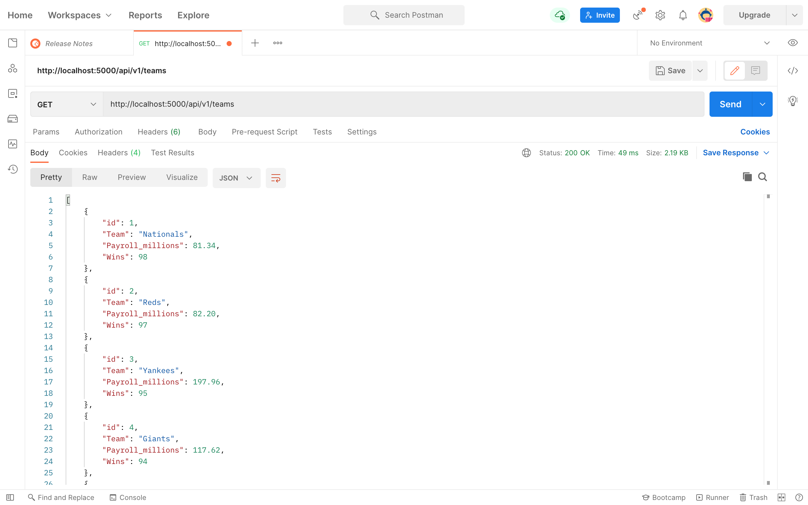
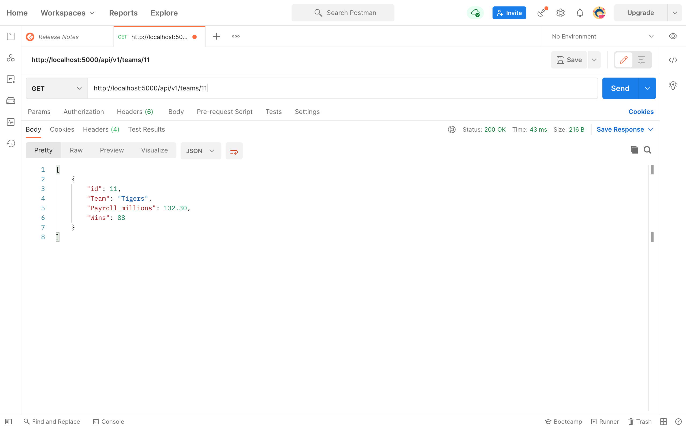
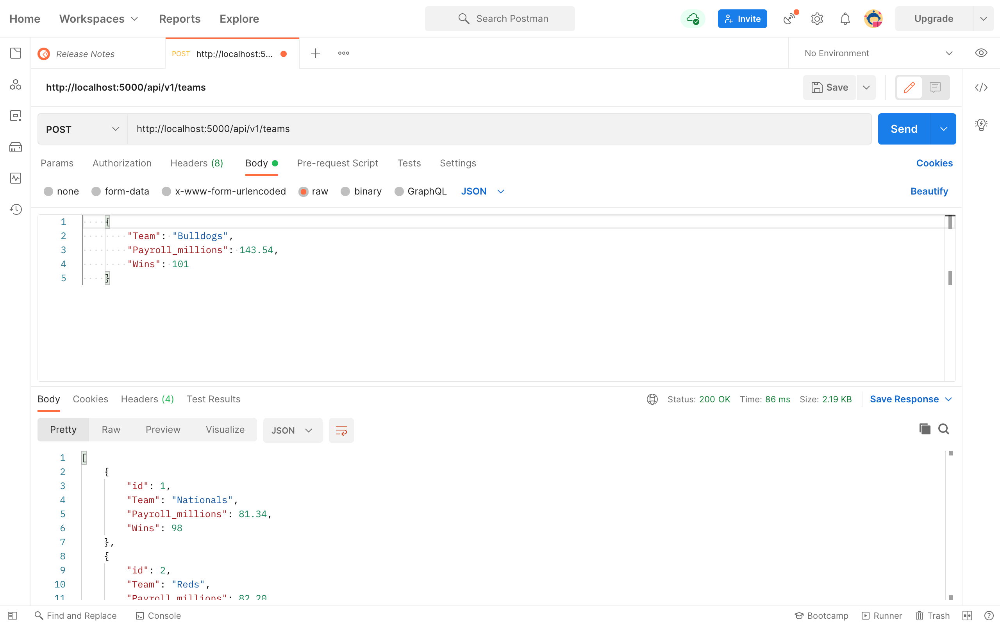
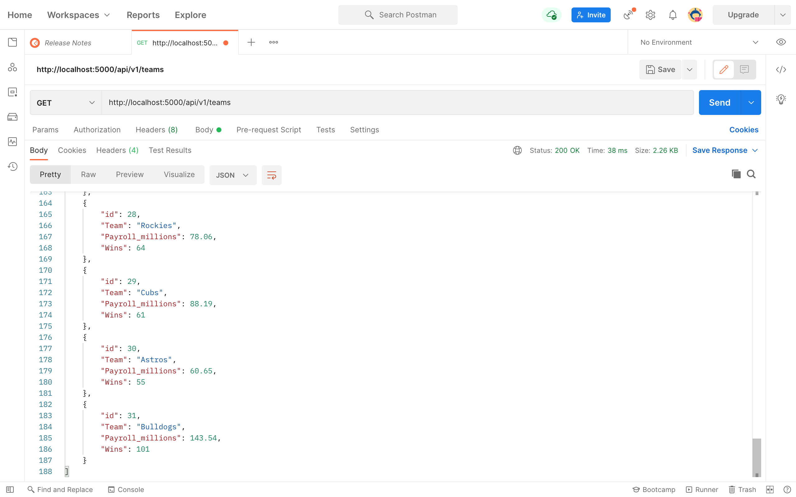
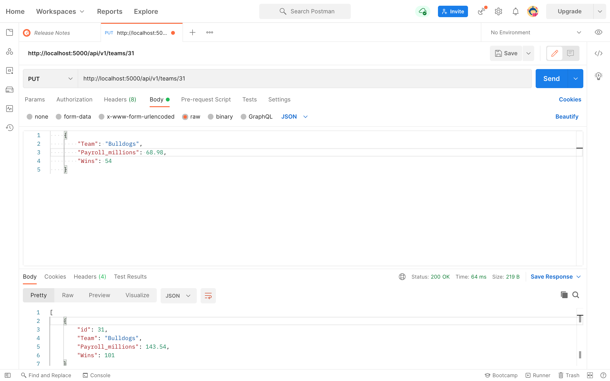
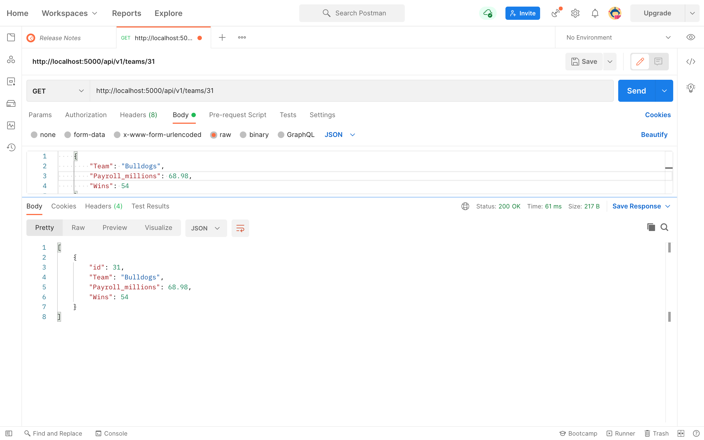
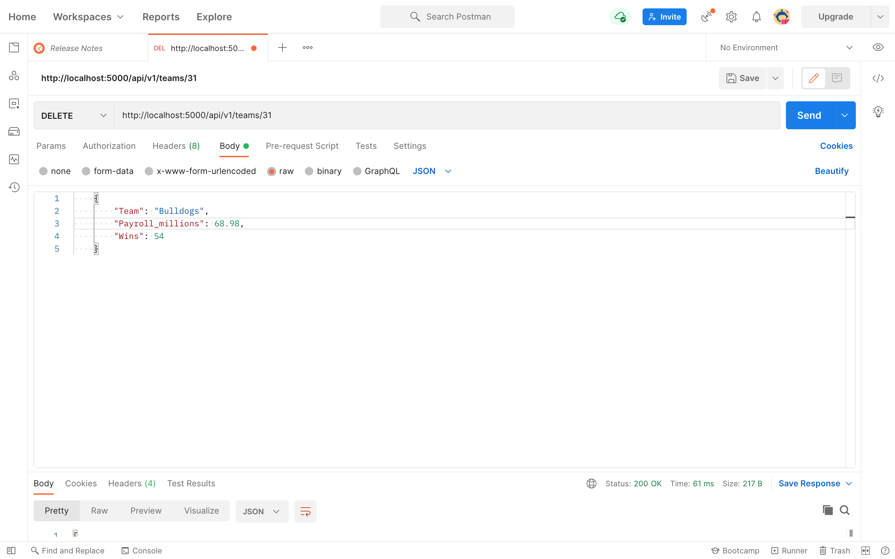

# Project 3
REST API with Flask, Docker, PyCharm, Postman and MySQL
## Project showing postman listing all records

## Project showing postman showing one record with a get request

## Project showing postman creating a record by showing the post request and the results in the record listing

## *Result*:

## Project showing postman edit a record by showing the put request and the results in the record listing

## *Result*:

## Project showing postman delete a record by showing the delete request and the results in the record listing

## *Result*:

